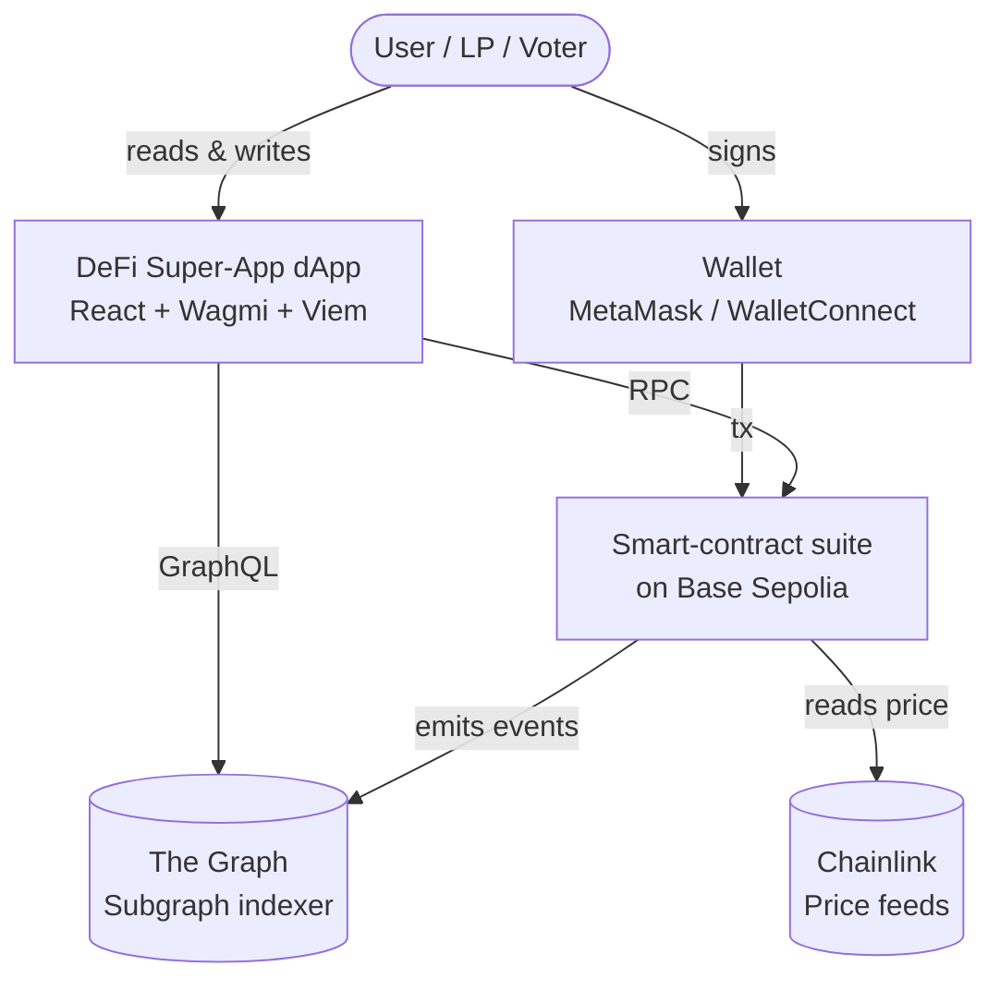
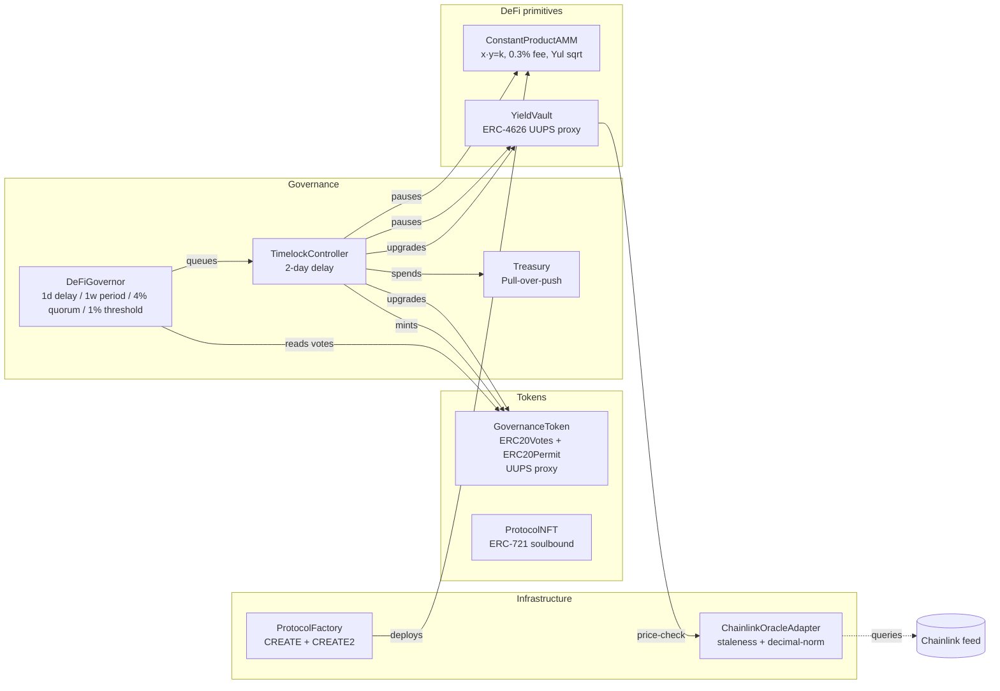
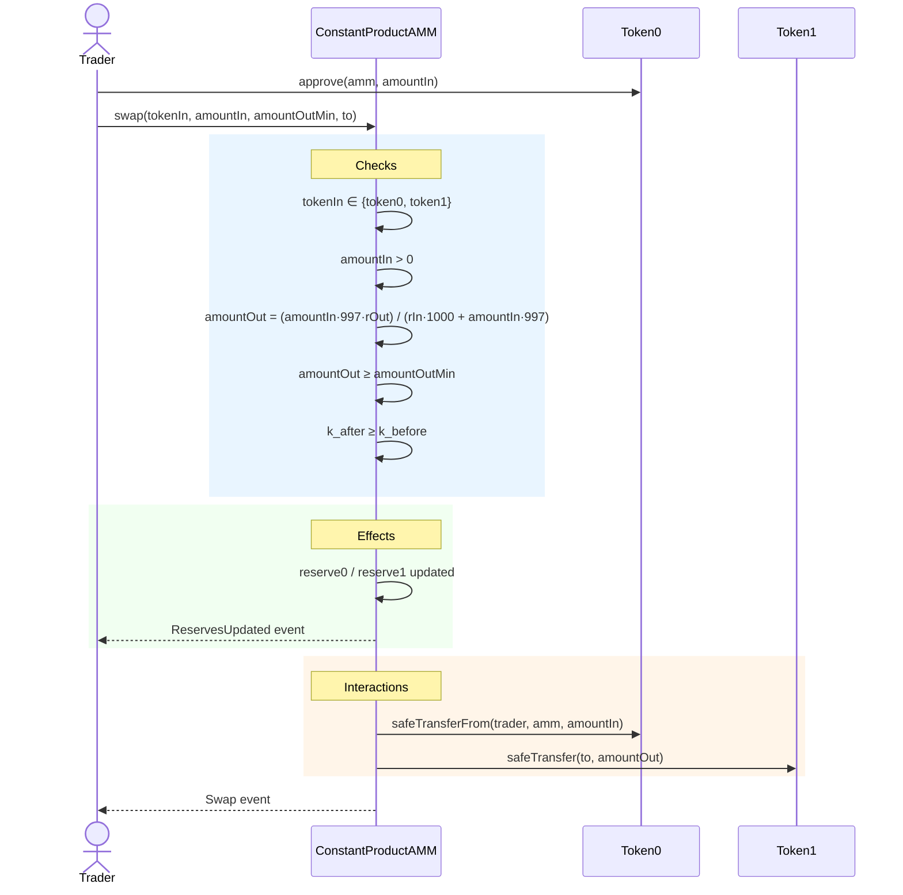
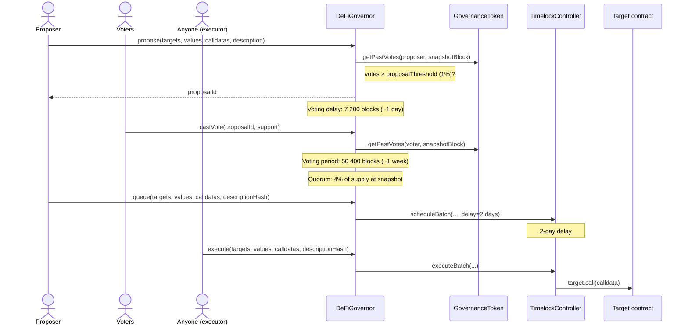
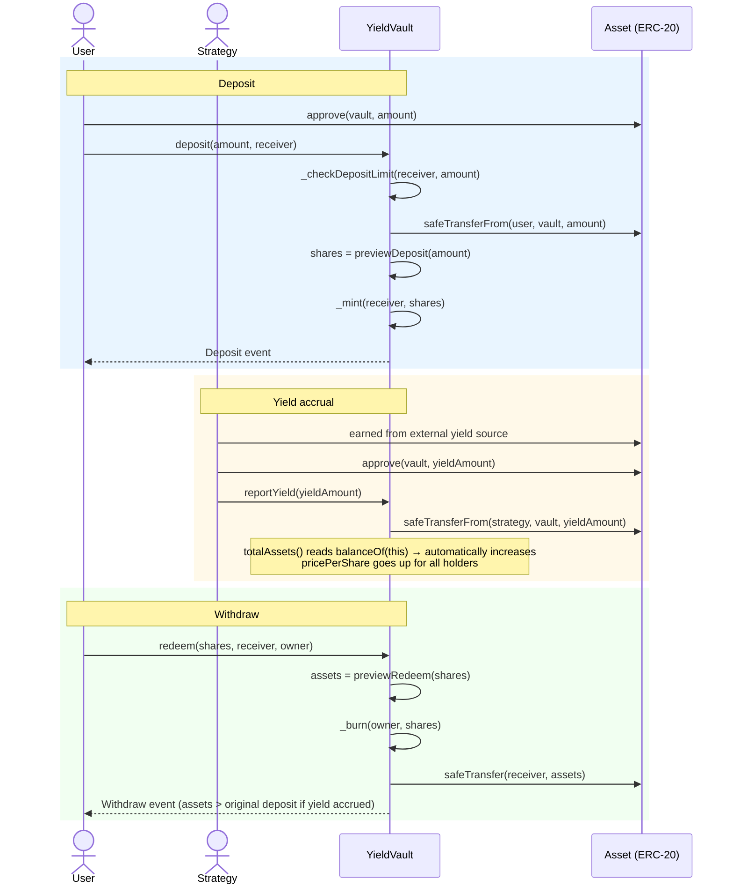

# Architecture & Design — DeFi Super-App

| Field | Value |
|---|---|
| Scenario | A — DeFi Super-App (AMM + ERC-4626 Vault + DAO) |
| Target network | Base Sepolia (chain ID 84532) |
| Compiler | Solidity 0.8.24, `via_ir = true`, optimizer 200 runs |
| Proxy pattern | UUPS (ERC-1967) on `GovernanceToken` and `YieldVault` |
| Governance | OpenZeppelin v5 Governor stack + TimelockController |
| Oracles | Chainlink AggregatorV3 wrapped in `IOracle` adapter |
| Indexing | The Graph, hosted on Base Sepolia |

---

## 1. System Context (C4 Level 1)

The protocol is a multi-component DeFi application deployed on an Ethereum
L2. End users interact through a dApp; the dApp reads on-chain state both
directly and through The Graph; the on-chain protocol reads asset prices
from Chainlink; governance actions go through a Timelock.



The protocol itself is the only system Anthropic is responsible for; The
Graph, Chainlink and wallet vendors are external dependencies whose security
properties we treat as part of our trust model (see §6).

---

## 2. Container Diagram (C4 Level 2)

Internally the protocol is organised into four groups: **tokens**, **DeFi
primitives**, **governance**, and **infrastructure**. The Timelock is the
hub through which all privileged actions flow.



### 2.1 Why these contracts (component justification)

- **GovernanceToken** is upgradeable because parameters such as `maxSupply`
  may need to change without burning user balances. V2 demonstrates the
  upgrade path by adding a configurable transfer tax.
- **ProtocolNFT** is soulbound so that "early LP" or "active voter" badges
  cannot be sold to wash voting power. It is a standalone ERC-721 with
  `AccessControl` MINTER_ROLE.
- **ConstantProductAMM** is the DeFi primitive built from scratch (per the
  brief). It is intentionally *not* upgradeable: AMMs that change formula
  break LP expectations, and the easier migration path is "deploy v2 pool,
  let LPs migrate liquidity".
- **YieldVault** is upgradeable because yield strategies, deposit limits,
  and oracle plumbing legitimately evolve.
- **DeFiGovernor + TimelockController** is the standard OpenZeppelin v5
  stack with parameters fixed to the project specification.
- **Treasury** uses the pull-over-push pattern: recipients call `claimETH`,
  the Treasury never pushes funds. This prevents the classic
  "malicious-recipient-revert blocks payout queue" DoS.
- **ChainlinkOracleAdapter** wraps Chainlink behind `IOracle`. The protocol
  contracts depend on the interface, not on Chainlink directly, so unit
  tests can inject a `MockAggregator`.
- **ProtocolFactory** demonstrates both CREATE (nonce-based, dynamic) and
  CREATE2 (salt-based, deterministic). Front-ends can pre-compute pool
  addresses for new pairs.

---

## 3. Sequence Diagrams

### 3.1 Swap



The order — Checks, then Effects, then Interactions — is the standard CEI
pattern; combined with `nonReentrant`, the swap is immune to re-entry-based
draining.

### 3.2 Propose → Vote → Queue → Execute



`GOV` is the sole `PROPOSER_ROLE` holder on the Timelock, so no party can
schedule timelocked actions outside the governance flow. After the 2-day
delay anyone can execute — execution is permissionless to prevent grief
from a non-responsive original proposer.

### 3.3 Deposit / Withdraw with yield



Yield is realised passively: because `totalAssets()` reads
`asset.balanceOf(address(this))`, any external token transfer into the
vault (subject to ERC-4626 inflation-attack mitigations) increases the
price-per-share for every existing holder. `reportYield` is just the
authenticated path through which the strategy delivers that transfer.

---

## 4. Data Model — Storage Layouts

Storage collision is the most dangerous class of bug in upgradeable systems.
This section enumerates the storage of every contract so that future
upgrades can be verified against it.

### 4.1 OZ v5 Namespaced Storage (ERC-7201)

OpenZeppelin v5 stores each parent contract's state in a single struct at
a deterministic, pseudo-random slot:

```
slot = keccak256(abi.encode(uint256(keccak256("openzeppelin.storage.<Name>")) - 1)) & ~bytes32(0xff)
```

This makes layout collision between unrelated parents **structurally
impossible**. We need only verify the local (contract-specific) variables.

### 4.2 GovernanceToken (V1)

| Local slot | Variable | Type | Notes |
|---|---|---|---|
| 0 | `maxSupply` | `uint256` | Cap enforced in `mint` |

### 4.3 GovernanceTokenV2

| Local slot | Variable | Type | Notes |
|---|---|---|---|
| 0 | `maxSupply` | `uint256` | Inherited from V1 — slot preserved |
| 1 | `transferTaxBps` | `uint256` | Appended in V2 |
| 2 | `treasury` | `address` | Appended in V2 |

V2 only appends. The `initializeV2(uint256, address)` function is guarded by
`reinitializer(2)`, so it can only be called once after the upgrade.

### 4.4 YieldVault

| Local slot | Variable | Type |
|---|---|---|
| 0 | `_reentrancyStatus` | `uint256` |
| 1 | `maxDepositPerUser` | `uint256` |
| 2 | `oracle` | `IOracle` (address) |
| 3 | `strategy` | `address` |

The manual reentrancy guard at slot 0 is intentional. When the team
introduces YieldVault V2:

- Append new variables after `strategy`.
- Do **not** swap the manual guard for `ReentrancyGuardUpgradeable` unless
  that contract's namespaced slot is verified empty (it is, in OZ v5).
- Use `reinitializer(2)` for any new init logic.

### 4.5 Non-upgradeable contracts

These have no proxy and no storage compatibility requirement, listed here
for completeness:

- `ConstantProductAMM`: `token0`, `token1` (immutables), `reserve0`, `reserve1`,
  plus inherited ERC-20 (LP token), AccessControl, ReentrancyGuard, Pausable.
- `ProtocolNFT`: `_nextTokenId`, `_baseTokenURI`, `soulbound`, plus inherited
  ERC721URIStorage and AccessControl.
- `ProtocolFactory`: `getPool` mapping, `allPools` array.
- `Treasury`: `pendingETH`, `pendingTokens` mappings (and per audit H-01,
  a future `totalPendingETH` / `totalPendingTokens` should be appended).
- `DeFiGovernor`: pure OZ stack — no local storage beyond inherited.
- `ChainlinkOracleAdapter`: `feed`, `maxStaleness`, `_feedDecimals` — all
  immutable.

---

## 5. Access Control Matrix

| Role | Holder | Operations gated |
|---|---|---|
| `DEFAULT_ADMIN_ROLE` (GovToken) | Timelock | Grant/revoke other roles |
| `MINTER_ROLE` (GovToken) | Timelock | `mint` up to `maxSupply` |
| `UPGRADER_ROLE` (GovToken) | Timelock | UUPS `_authorizeUpgrade` |
| `DEFAULT_ADMIN_ROLE` (Vault) | Timelock | Grant/revoke other roles; `setStrategy`, `setMaxDepositPerUser`, `setOracle` |
| `PAUSER_ROLE` (Vault) | Timelock | `pause`, `unpause` |
| `UPGRADER_ROLE` (Vault) | Timelock | UUPS `_authorizeUpgrade` |
| `STRATEGY_ROLE` (Vault) | Strategy contract | `reportYield` |
| `PAUSER_ROLE` (AMM, per pool) | Per-pool admin (see audit L-02) | `pause`, `unpause` |
| `MINTER_ROLE` (NFT) | Timelock (deployer until transferred) | `mint`, `batchMint` |
| `DEFAULT_ADMIN_ROLE` (NFT) | Timelock | `setSoulbound`, `setBaseURI` |
| `POOL_CREATOR_ROLE` (Factory) | Multisig | `createPool`, `createPool2` |
| `SPENDER_ROLE` (Treasury) | Timelock | `allocateETH`, `allocateToken` |
| `DEFAULT_ADMIN_ROLE` (Treasury) | Multisig | Re-assign other Treasury roles |
| `PROPOSER_ROLE` (Timelock) | DeFiGovernor | `scheduleBatch` |
| `CANCELLER_ROLE` (Timelock) | Multisig | Cancel queued proposals |
| `EXECUTOR_ROLE` (Timelock) | Anyone (`address(0)`) | `executeBatch` after delay |

The deliberate design choice: every state-changing privileged action on a
core contract goes through the Timelock, which requires (i) a passed
on-chain vote and (ii) a 2-day public delay before execution. The multisig
holds only emergency powers (cancel a queued proposal, re-assign Treasury
roles if the Governor itself becomes broken).

---

## 6. Trust Assumptions

### 6.1 Trusted parties

- **Chainlink node operators** — assumed to deliver honest, timely prices.
  Mitigated by aggregator's own decentralisation; further mitigated by our
  staleness window.
- **The Graph indexers** — assumed to honestly serve the indexed schema.
  Mitigated by indexer slashing in The Graph's protocol; further mitigated
  by the dApp falling back to direct RPC if Graph queries fail.
- **Arbitrum sequencer** — assumed to order transactions honestly. Mitigated
  by Arbitrum's L1 escape hatch (force-include from L1).
- **OpenZeppelin contract maintainers** — assumed not to ship malicious
  updates. Mitigated by pinning to a specific tag in `.gitmodules`.
- **Multisig signers** — assumed honest. Mitigated by 3-of-5 hardware-wallet
  setup recommended in the audit report (§5).

### 6.2 Untrusted parties

- All token-holders, voters, LPs, traders, depositors, vault strategies.
  Every entry point validates inputs and the protocol does not depend on
  any user being honest.

### 6.3 What happens if X fails

| Failure | Blast radius | Recovery path |
|---|---|---|
| Chainlink feed stalls | `safePrice()` reverts; oracle-gated functions become unavailable | Wait for feed, or governance proposal to swap adapter |
| The Graph indexer down | dApp falls back to direct RPC; UX degrades but state is unaffected | Outside protocol scope |
| Multisig key compromised | Attacker can cancel queued proposals (DoS) and re-grant Treasury roles | Time-bounded: proposals can be resubmitted; Treasury drain requires the attacker to be the SPENDER which is still the Timelock |
| Governor contract compromised | Attacker can queue arbitrary actions on Timelock; 2 days to cancel via multisig CANCELLER | Multisig cancels, community redeploys Governor and migrates `PROPOSER_ROLE` |
| Timelock compromised | Catastrophic — controls every upgrade and treasury action | Mitigated only by Timelock being immutable code (OZ TimelockController, not custom) |

---

## 7. Architecture Decision Records

This section captures the design decisions that shaped the architecture.
Each ADR follows the format: context → options → decision → consequences.

### ADR-01 — UUPS over Transparent Proxy

**Context.** Two contracts need upgradeability: `GovernanceToken` (so the
token can evolve with governance) and `YieldVault` (so strategies and
deposit caps can change).

**Options.**
1. Transparent proxy (admin separate from user calls).
2. UUPS (`_authorizeUpgrade` on the implementation itself).
3. Beacon proxy.

**Decision.** UUPS for both.

**Consequences.**
- Smaller per-contract deploy bytecode (no admin-slot in the proxy).
- Upgrade authorisation is part of the implementation, so a buggy
  implementation that removes `_authorizeUpgrade` *bricks the contract* —
  this is well-known and we mitigate by writing the V2 upgrade test
  (`test_Upgrade_PreservesBalance` etc.) which exercises the full upgrade
  path.
- No proxy-admin contract to manage; `UPGRADER_ROLE` on the implementation
  is held by the Timelock, so upgrades are governance-gated by design.

### ADR-02 — CREATE2 for the AMM Factory

**Context.** Front-ends want to display "the pool address for token pair
X/Y" before the pool exists, so they can pre-populate UI and quote prices.

**Options.**
1. Only CREATE — addresses depend on factory nonce, unpredictable.
2. Only CREATE2 — addresses deterministic from salt = keccak256(token0, token1).
3. Both — keep CREATE as an escape hatch for re-deployments after
   accidental token-pair clashes.

**Decision.** Both. CREATE is `createPool`, CREATE2 is `createPool2`.

**Consequences.**
- Deterministic-address property is currently broken because the
  constructor takes `msg.sender` as admin (audit M-01); fix proposed.
- The brief explicitly required demonstrating both, so option 3 also
  satisfies that.

### ADR-03 — Pull-over-push in Treasury

**Context.** Treasury distributes grants from governance proposals.

**Options.**
1. Push: `allocateETH(recipient, amount)` immediately sends.
2. Pull: `allocateETH` records, `claimETH` sends.

**Decision.** Pull.

**Consequences.**
- A malicious recipient with a reverting `receive` cannot block their
  allocation or any other allocation in the same batch.
- Two transactions per grant instead of one — acceptable, governance is
  not a high-frequency path.
- Required additional accounting (see audit H-01) to prevent
  over-allocation: this is being added.

### ADR-04 — Block-number clock for ERC20Votes

**Context.** OpenZeppelin v5 `ERC20Votes` exposes `clock()` which can
return either `block.number` or `block.timestamp`.

**Options.**
1. `block.number` — discrete, predictable, matches Governor defaults.
2. `block.timestamp` — continuous, allows time-based delegation but breaks
   the default Governor block-based delays.

**Decision.** `block.number`.

**Consequences.**
- Voting delay (1 day) and voting period (1 week) are expressed in blocks
  (7 200 and 50 400 respectively), assuming 12-second blocks. On Arbitrum
  Sepolia blocks are faster, so on-chain durations are *shorter* than
  the nominal "1 day" / "1 week". Documented in `verify.s.sol`.

### ADR-05 — 2-day Timelock delay

**Context.** Brief specifies 2-day delay.

**Decision.** Set `TimelockController` with `2 days` as the minimum delay.

**Consequences.**
- Combined with the 1-day voting delay and 1-week voting period, no
  governance action can take effect in less than ~10 days from proposal
  creation. This gives time for the multisig to cancel a malicious
  proposal during the 2-day window after queueing.

### ADR-06 — Oracle adapter abstraction

**Context.** Tests must run without a live Chainlink feed; production
must use a real feed; future versions may swap feeds or add Pyth.

**Decision.** All protocol contracts depend on `IOracle`, never directly
on Chainlink. `ChainlinkOracleAdapter` and `MockAggregator` are the two
concrete implementations.

**Consequences.**
- Trivial test setup via `MockAggregator`.
- Future oracle providers can be added by writing a new adapter; no
  protocol-contract changes required.

### ADR-07 — Yul Babylonian sqrt in `ConstantProductAMM`

**Context.** Initial liquidity mint computes `sqrt(amount0 * amount1)`.

**Options.**
1. Pure Solidity loop.
2. Inline Yul Babylonian method.

**Decision.** Yul. The Solidity version is kept in-source for benchmark
comparison (see `docs/gas-report.md`).

**Consequences.**
- Measurable gas saving on first liquidity addition (the only path that
  calls `_sqrt`).
- Adds a small surface for Yul-specific bugs; mitigated by edge-case unit
  tests (`y ∈ {0, 1, 2, 3, 4}`) and a fuzz test comparing Yul vs Solidity
  outputs.

---

## 8. External Dependencies

| Dependency | Version | Why pinned |
|---|---|---|
| OpenZeppelin Contracts | v5.x | Used for AccessControl, ERC20, ERC721, Governor, TimelockController, ReentrancyGuard, Pausable, SafeERC20 |
| OpenZeppelin Contracts Upgradeable | v5.x | UUPS, ERC4626Upgradeable, ERC20VotesUpgradeable, ERC20PermitUpgradeable |
| Chainlink Contracts | Latest tag (for `AggregatorV3Interface` only) | Interface re-declared locally to avoid pulling the entire Chainlink monorepo |
| forge-std | Latest tag | Test framework |

All pinned via git submodules in `.gitmodules`; reproducible builds via
`git submodule update --init --recursive`.

---

## 9. Deployment Topology

```mermaid
flowchart LR
    DEP[Deployer EOA] --> GT[GovernanceToken impl + proxy]
    DEP --> NFT[ProtocolNFT]
    DEP --> ORA[ChainlinkOracleAdapter]
    DEP --> FAC[ProtocolFactory]
    FAC --> AMM[ConstantProductAMM pool]
    DEP --> VLT[YieldVault impl + proxy]
    DEP --> TL[TimelockController<br/>proposers=[], executors=[0]]
    DEP --> GOV[DeFiGovernor]
    DEP --> TR[Treasury]

    GOV -- granted PROPOSER --> TL
    DEP -. revokes admin .-> TL
    DEP -- transfers UPGRADER/ADMIN --> GT
    DEP -- transfers UPGRADER/ADMIN --> VLT
```

The deploy script (`script/deploy.s.sol`) is idempotent at the script level
(one run = one set of contracts) and CREATE2-deterministic at the pool
level. The post-deploy verification (`script/verify.s.sol`) checks the
final wiring; before submission it must pass cleanly (see audit M-02 for
the current bug in the verification logic).

---

## 10. Off-chain Components

### 10.1 Subgraph

Indexes events from the AMM, Governor, and YieldVault. The data model
(see `subgraph/schema.graphql`) exposes six entities: `Pool`, `Swap`,
`LiquidityEvent`, `Proposal`, `Vote`, `VaultSnapshot`, plus a singleton
`ProtocolStats` aggregator.

The mapping files (`subgraph/src/amm.ts`, `subgraph/src/governor.ts`,
`subgraph/src/vault.ts`) translate raw events into entity writes. The
front-end queries the subgraph for historical lists (recent swaps,
proposal lists, voter histories, vault price-per-share over time).

### 10.2 Frontend

React + Wagmi + Viem application. Connects via MetaMask or WalletConnect.
Reads token balance, voting power, delegate address, pool reserves and
vault shares directly from contracts; reads historical lists from the
subgraph. Three write paths: `swap`, `deposit`, `vote`. Wrong-network
detection and friendly error messages on revert.

---
